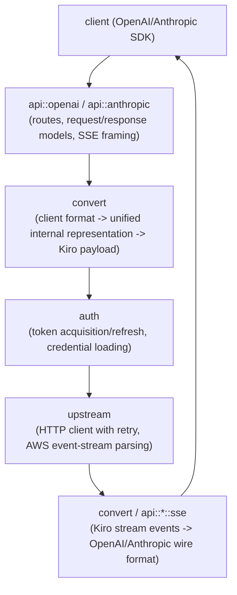

English | [简体中文](README.zh-CN.md)

# Lanius

An OpenAI- and Anthropic-compatible API gateway for the Kiro backend
(Amazon Q Developer / AWS CodeWhisperer). Lanius lets tools and clients built
against the OpenAI Chat Completions API or the Anthropic Messages API talk
to Kiro without knowing anything about Kiro's own protocol.


## Workspace layout

This is a Cargo workspace with three crates:

| Crate | Description |
|---|---|
| [`crates/lanius-core`](crates/lanius-core) | The gateway itself: HTTP server, request/response conversion, auth, streaming parser, and all business logic. A library crate consumed by both `lanius-cli` and `lanius-gui`. |
| [`crates/lanius-cli`](crates/lanius-cli) | Headless binary (`lanius`) for running the gateway as a server process, replaying captured streams offline, and probing the live Kiro backend for debugging. |
| [`crates/lanius-gui`](crates/lanius-gui) | Desktop app (`lanius-desktop`, built with [Slint](https://slint.dev)) that runs the gateway in-process, with a UI for configuration, live logs, model list, and usage. |

### Request flow (`lanius-core`)



Supporting modules: `compat` (per-client compatibility hooks, e.g. tool-name
aliasing and model-id rewriting), `model` (model catalog cache, name
resolution, and per-model native thinking/reasoning support read from the
catalog schema), `truncation` (recovery from upstream tool-call/content
truncation), `tokenizer`
(token estimation), and `config`/`error` (configuration and unified error
types).

See each module's `//!` doc comment (e.g. `cargo doc --open -p lanius-core`)
for details on individual components, or the [`docs/`](docs) directory for
higher-level, topic-by-topic write-ups (architecture, request flow,
conversion, auth, streaming, compatibility hooks, model resolution,
truncation recovery, configuration reference, the desktop GUI, and the test
suite). Start at [`docs/README.md`](docs/README.md).

## Building

Requires a recent stable Rust toolchain (edition 2024, `rust-version = "1.85"`).

```sh
# Build everything
cargo build --workspace

# Build/run just the headless server
cargo run -p lanius-cli

# Build the desktop app (requires Slint's platform dependencies)
cargo run -p lanius-gui
```

## Running the gateway

The CLI binary is `lanius`:

```sh
lanius                          # validate config and start serving
lanius probe [prompt]           # live end-to-end request against the Kiro backend
lanius probe --capture out.bin  # same, saving the raw upstream stream to a file
lanius replay out.bin           # offline-decode a previously captured raw stream
lanius help
```

Configuration is read from the environment (a `.env` file is also loaded if
present). Key variables — see [`docs/configuration.md`](docs/configuration.md)
or [`crates/lanius-core/src/config.rs`](crates/lanius-core/src/config.rs)
for the full, authoritative list and defaults:

| Variable | Purpose |
|---|---|
| `PROXY_API_KEY` | Bearer key clients must present to Lanius. Required, must not be empty. |
| `KIRO_REGION` | AWS region used to build Kiro/OIDC endpoint URLs. |
| `SERVER_HOST` / `SERVER_PORT` | Bind address for the gateway's HTTP server. |
| `REFRESH_TOKEN` / `PROFILE_ARN` | Refresh token and (optional) profile ARN used to authenticate with Kiro. |
| `KIRO_CREDS_FILE` / `KIRO_CLI_DB_FILE` | Alternative credential sources (JSON file / Kiro CLI's SQLite DB). |
| `LOG_LEVEL` / `DEBUG_MODE` | Logging verbosity and optional request/response debug capture. |

The gateway exposes:

- `GET /v1/models`, `POST /v1/chat/completions` — OpenAI-compatible API
- `POST /v1/messages`, `POST /v1/messages/count_tokens` — Anthropic-compatible API
- `GET /usage`, `GET /account` — usage/quota for the configured account, gated by `PROXY_API_KEY`
- `GET /health` — unauthenticated health check

All routes other than `/health` require the `PROXY_API_KEY` bearer token, and
CORS is restricted to `localhost`/`127.0.0.1` origins.

## Testing

```sh
cargo test --workspace
```

Includes unit tests across `lanius-core` and `lanius-gui`, plus
`lanius-cli`'s GUI/desktop config-mapping contract tests.

## License

AGPL-3.0 — see [LICENSE](LICENSE).
