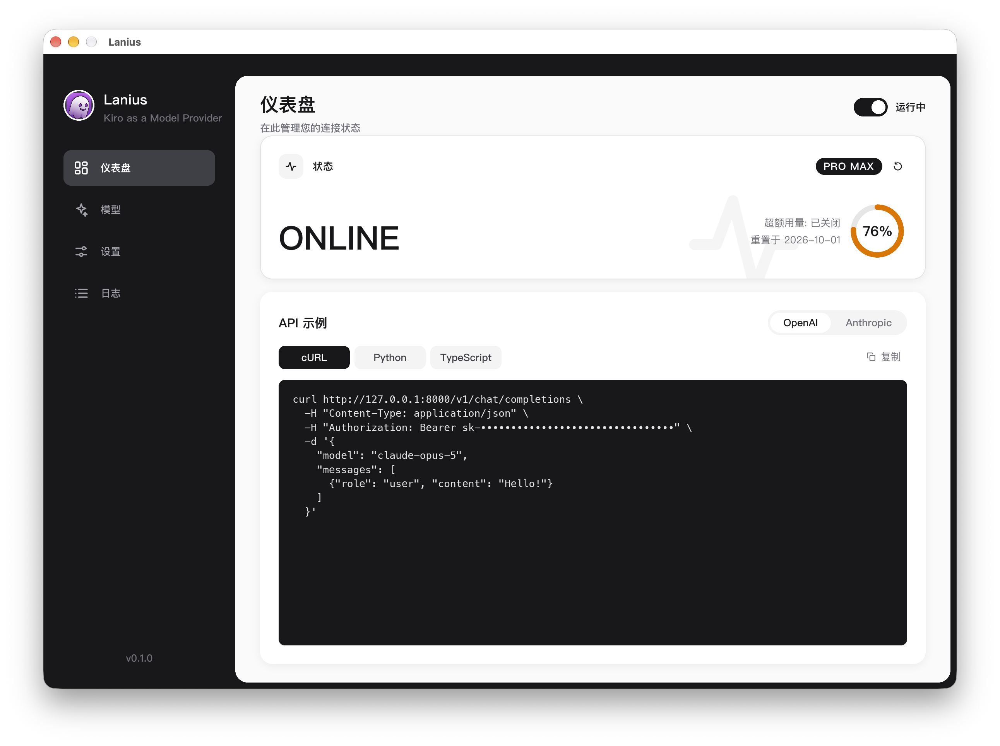
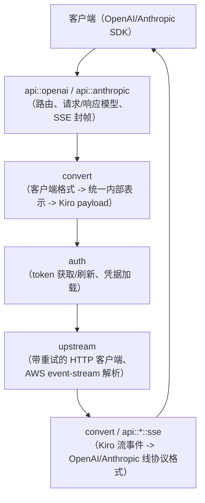

> [English](README.md) | 简体中文

# Lanius

面向 Kiro 后端（Amazon Q Developer / AWS CodeWhisperer）的 OpenAI 与 Anthropic
兼容 API 网关。借助 Lanius，基于 OpenAI Chat Completions API 或 Anthropic
Messages API 构建的工具和客户端无需了解 Kiro 自身的协议即可直接与 Kiro 通信。



## 工作区结构

本项目是一个包含三个 crate 的 Cargo workspace：

| Crate | 说明 |
|---|---|
| [`crates/lanius-core`](crates/lanius-core) | 网关本体：HTTP 服务器、请求/响应转换、认证、流式解析器以及全部业务逻辑。它是一个库 crate，供 `lanius-cli` 和 `lanius-gui` 共同使用。 |
| [`crates/lanius-cli`](crates/lanius-cli) | 无界面二进制程序（`lanius`），用于以服务进程方式运行网关、离线回放已捕获的数据流，以及探测线上 Kiro 后端以便调试。 |
| [`crates/lanius-gui`](crates/lanius-gui) | 桌面应用（`lanius-desktop`，基于 [Slint](https://slint.dev) 构建），在进程内运行网关，并提供配置、实时日志、模型列表和用量查看界面。 |

### 请求流程（`lanius-core`）



辅助模块：`compat`（针对各客户端的兼容性钩子，例如工具名别名和模型 ID 改写）、
`model`（模型目录缓存、名称解析，以及从目录 schema 读取的各模型原生
thinking/reasoning 支持）、`truncation`（从上游 tool call/内容截断中恢复）、
`tokenizer`（token 估算），以及 `config`/`error`（配置与统一错误类型）。

各组件的细节请参阅对应模块的 `//!` 文档注释（例如 `cargo doc --open -p lanius-core`），
或查看 [`docs/zh-CN/`](docs/zh-CN) 目录下按主题划分的高层文档（架构、请求流程、
转换、认证、流式处理、兼容性钩子、模型解析、截断恢复、配置参考、桌面 GUI 以及
测试套件）。建议从 [`docs/zh-CN/README.md`](docs/zh-CN/README.md) 开始阅读。

## 构建

需要较新的 stable Rust 工具链（edition 2024，`rust-version = "1.85"`）。

```sh
# 构建全部
cargo build --workspace

# 仅构建/运行无界面服务器
cargo run -p lanius-cli

# 构建桌面应用（需要 Slint 的平台依赖）
cargo run -p lanius-gui
```

## 运行网关

CLI 二进制程序名为 `lanius`：

```sh
lanius                          # 校验配置并开始提供服务
lanius probe [prompt]           # 向线上 Kiro 后端发起一次端到端请求
lanius probe --capture out.bin  # 同上，并将原始上游数据流保存到文件
lanius replay out.bin           # 离线解码之前捕获的原始数据流
lanius help
```

配置从环境变量读取（若存在 `.env` 文件也会一并加载）。主要变量如下，完整且权威的
列表及默认值请参阅 [`docs/zh-CN/configuration.md`](docs/zh-CN/configuration.md)
或 [`crates/lanius-core/src/config.rs`](crates/lanius-core/src/config.rs)：

| 变量 | 用途 |
|---|---|
| `PROXY_API_KEY` | 客户端访问 Lanius 时必须提供的 Bearer 密钥。必填，且不能为空。 |
| `KIRO_REGION` | 用于构造 Kiro/OIDC 端点 URL 的 AWS 区域。 |
| `SERVER_HOST` / `SERVER_PORT` | 网关 HTTP 服务器的监听地址。 |
| `REFRESH_TOKEN` / `PROFILE_ARN` | 用于向 Kiro 认证的 refresh token 和（可选的）profile ARN。 |
| `KIRO_CREDS_FILE` / `KIRO_CLI_DB_FILE` | 备选凭据来源（JSON 文件 / Kiro CLI 的 SQLite 数据库）。 |
| `LOG_LEVEL` / `DEBUG_MODE` | 日志详细程度，以及可选的请求/响应调试捕获。 |

网关提供以下接口：

- `GET /v1/models`、`POST /v1/chat/completions`：OpenAI 兼容 API
- `POST /v1/messages`、`POST /v1/messages/count_tokens`：Anthropic 兼容 API
- `GET /usage`、`GET /account`：所配置账号的用量/配额，需要 `PROXY_API_KEY`
- `GET /health`：无需认证的健康检查

除 `/health` 外的所有路由都需要 `PROXY_API_KEY` bearer token，且 CORS 仅允许
`localhost`/`127.0.0.1` 来源。

### 在 Linux 上部署（systemd）

每个 GitHub Release 都附带预构建的静态 Linux 二进制（amd64/arm64）。安装 `lanius`
并将其作为加固的 systemd 服务运行，请参阅
[`docs/zh-CN/deployment.md`](docs/zh-CN/deployment.md)。

## 测试

```sh
cargo test --workspace
```

包括 `lanius-core` 和 `lanius-gui` 中的单元测试，以及 `lanius-cli` 的 GUI/桌面
配置映射契约测试。

## 许可证

AGPL-3.0，详见 [LICENSE](LICENSE)。
