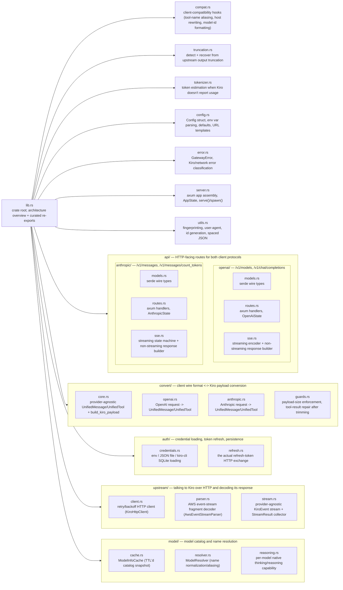
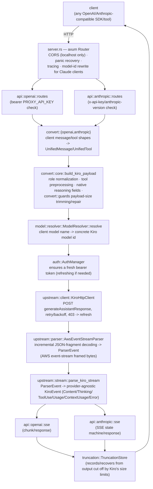

# Architecture

## Workspace layout

Lanius is a Cargo workspace with three crates:

| Crate | Kind | Responsibility |
|---|---|---|
| `lanius-core` | library | The gateway itself — HTTP routes, protocol conversion, auth, streaming parser, model catalog, all business logic. Consumed by both binaries below. |
| `lanius-cli` | binary (`lanius`) | Headless server process, plus `probe`/`replay` debugging subcommands. Thin wrapper: no protocol logic of its own. |
| `lanius-gui` | binary (`lanius-desktop`) | Desktop app (Slint UI) that runs the gateway in-process and adds configuration, live logs, model list, and usage views. |

`lanius-core` is deliberately the only place that understands the OpenAI/
Anthropic/Kiro protocols. Both binaries call into it through a small,
curated public surface (see `crates/lanius-core/src/lib.rs`); everything
else inside `lanius-core` is `pub(crate)` and reached only through each
module's own facade (e.g. `crate::upstream::KiroHttpClient`,
`crate::model::ModelResolver`).

## Why a gateway at all

Kiro (Amazon Q Developer / AWS CodeWhisperer) speaks its own request/
response protocol over a custom AWS event-stream framing, not the OpenAI
Chat Completions API or the Anthropic Messages API. Lanius sits in front of
Kiro and exposes both of those familiar wire formats, so existing tools,
SDKs, and editor integrations that speak OpenAI or Anthropic can point at
Lanius's `/v1/...` endpoints without any code changes, while Lanius handles
authentication, protocol translation, and the quirks of Kiro's actual
backend.

## Module map (`lanius-core`)

## Data flow

## Cross-cutting concerns

- **`config`** — every tunable is an environment variable with a documented
  default (see [configuration.md](configuration.md)); `Config::validate`
  runs once at startup and refuses to serve with an insecure/invalid setup.
- **`error`** — a single `GatewayError` enum spans config, auth, network,
  and upstream-classified errors; `error::enhance_kiro_error` turns Kiro's
  raw error payloads into actionable messages (e.g. distinguishing "context
  length exceeded" from a generic 400).
- **`compat`** — behaviors that are neither "shape conversion" (`convert`)
  nor "credentials" (`auth`) but still apply to nearly every request: tool
  name aliasing for Kiro's 64-character name limit, host rewriting for
  control-plane-only operations, and Claude-client-specific model-id
  formatting. See [compatibility.md](compatibility.md).
- **`utils`** — byte-for-byte matching of Kiro's expected wire format
  (spaced JSON separators, specific header casing/ordering, a stable
  per-machine fingerprint) lives here since it's needed by both `convert`
  and `upstream`.

## Where to look next

- Tracing one request end-to-end: [request-flow.md](request-flow.md)
- How message/tool shapes are translated: [conversion.md](conversion.md)
- Credentials and token refresh: [auth.md](auth.md)
- Decoding Kiro's streaming response: [streaming.md](streaming.md)
