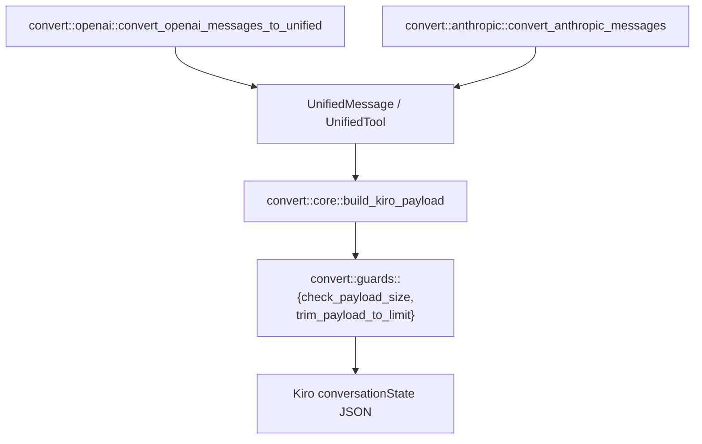

# Request/Response Conversion (`convert`)

The `convert` module translates between each client protocol's wire format
and Kiro's `conversationState` payload shape. It is split into a
provider-agnostic core plus one adapter per client protocol, so the
normalization rules (role alternation, tool-result placement, native
reasoning fields, payload trimming) are implemented and tested exactly once.



## The unified representation

`UnifiedMessage` and `UnifiedTool` (`convert/core.rs`) are the
provider-agnostic types both adapters produce:

```rust
pub struct UnifiedMessage {
    pub role: String,            // "user" | "assistant"
    pub content: Value,          // text or JSON content
    pub tool_calls: Vec<Value>,  // OpenAI-shaped, kept as raw JSON
    pub tool_results: Vec<Value>,
    pub images: Vec<UnifiedImage>,
}

pub struct UnifiedTool {
    pub name: String,
    pub description: Option<String>,
    pub input_schema: Option<Map<String, Value>>,
}
```

`tool_calls`/`tool_results` are deliberately kept as raw OpenAI-shaped JSON
rather than a typed struct, since both the conversion and the later
re-serialization into Kiro's format operate on that shape directly.

## Provider-specific adapters

**`convert::openai`** (`convert_openai_messages_to_unified`):
- OpenAI allows multiple `system` messages anywhere in the list; they are
  extracted entirely and joined with `\n` into one system prompt string,
  since Kiro wants a single combined prompt up front.
- OpenAI represents each tool result as its own `role: "tool"` message.
  These are buffered rather than emitted immediately (`flush_tool_results`)
  and attached to the *next* user turn's `tool_results` field — flushed
  whenever a non-tool message is encountered, and once more at the end so
  trailing results aren't dropped if the list ends on them.
- `reasoning_request_from_openai` maps the request's `reasoning_effort`
  field onto the target model's supported effort levels (see
  [model-catalog.md](model-catalog.md)).

**`convert::anthropic`** (`convert_anthropic_messages`):
- Mirrors the OpenAI adapter's structure but starts from Anthropic's typed
  content-block model (`ContentBlock::{Text,Thinking,ToolUse,ToolResult,...}`)
  rather than OpenAI's looser JSON shapes.
- `extract_system_prompt` handles all three `SystemPrompt` shapes (plain
  string, typed blocks, raw fallback blocks) uniformly.
- Native thinking blocks and their signatures are preserved through the
  round trip so multi-turn conversations replay a previous turn's reasoning
  correctly.

Both adapters register any tool name needing rewriting into a shared,
per-request `ToolNameAliases` table *before* history conversion runs, so a
tool referenced identically in an old assistant turn and a fresh tool
definition get the same alias (see
[compatibility.md](compatibility.md#tool-name-aliasing)).

## `build_kiro_payload` — the provider-agnostic core

Given the unified messages/tools plus system prompt, model id, conversation
id, and profile ARN, `build_kiro_payload` performs (in order):

1. **Tool preprocessing** — over-long tool descriptions
   (`tool_description_max_length`) are moved out of the tool definition and
   into the system prompt as appended documentation
   (`process_tools_with_long_descriptions`), then remaining tool names are
   validated (`validate_tool_names`).
2. **System prompt assembly** — caller-supplied prompt + relocated tool
   documentation + (if `config.truncation_recovery`) the
   truncation-recovery instructional addition.
3. **Tool-context preprocessing** (`preprocess_tool_context`) — flattens
   tool calls/results into narrative text when no tools are declared for
   the current turn, or when a tool result appears without a preceding
   assistant tool call to attach to (Kiro requires a strict call/result
   pairing that clients don't always guarantee, e.g. after context
   compaction on the client side).
4. **Role normalization** — merges adjacent same-role turns
   (`merge_adjacent_messages`), then applies
   `ensure_alternating_roles(normalize_message_roles(ensure_first_message_is_user(...)))`
   so the sequence satisfies Kiro's strict user/assistant alternation
   starting on a user turn.
5. **History/current split** — the normalized sequence is split into
   `history` (everything but the last message) and the `currentMessage`
   Kiro expects as the live turn.
6. **Native reasoning fields** — if the resolved model supports native
   thinking/reasoning (see [model-catalog.md](model-catalog.md)), the
   request's reasoning settings are rendered into Kiro's
   `additionalModelRequestFields` shape via
   `ReasoningCapability::request_fields`, sent at the top level of the
   request (Kiro ignores this field anywhere else).
7. **Size enforcement** (`convert::guards`) — the assembled payload's size
   is measured the way Kiro counts it (compact ASCII-escaped JSON, so
   multi-byte characters count by their `\uXXXX`-escaped length, not raw
   UTF-8 bytes — see `check_payload_size`). If it exceeds
   `kiro_max_payload_bytes` and `auto_trim_payload` is enabled,
   `trim_payload_to_limit` repeatedly drops the *oldest user/assistant pair*
   from history (never a single entry, to keep alternation intact) until it
   fits, then repairs any `toolResults` entries left dangling by the trim
   (`repair_orphaned_tool_results`) and drops any leading non-user entries
   the pair-wise trim didn't land cleanly on.

The result is a `KiroPayloadResult { payload, tool_documentation }` — the
ready-to-send request body, plus the tool-documentation text that was moved
into the system prompt (returned separately so callers can, e.g., log or
inspect it).

## Images

Inline images are normalized into `UnifiedImage { media_type, data }`
regardless of source shape: OpenAI's `image_url` with a `data:` URL
(`extract_images_from_content` parses the data URL via `parse_data_url`) or
Anthropic's `image` block with an explicit base64 `source`. Malformed
blocks or blocks with empty data are silently skipped rather than erroring,
since a single bad image shouldn't fail an otherwise-valid request.

## Testing this module

`convert/openai.rs`, `convert/anthropic.rs`, `convert/core.rs`, and
`convert/guards.rs` each carry their own `#[cfg(test)]` unit tests plus
doctests on the public functions. `tests/tool_followup_payload.rs` is an
integration test specifically covering the tool-definition/tool-result
alias round trip across a full conversion.
