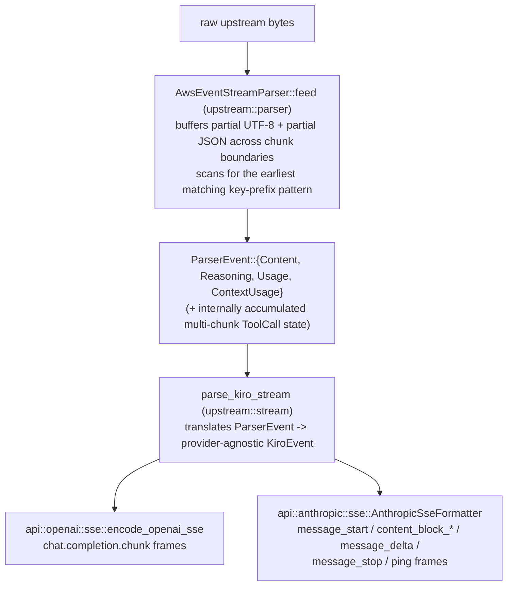
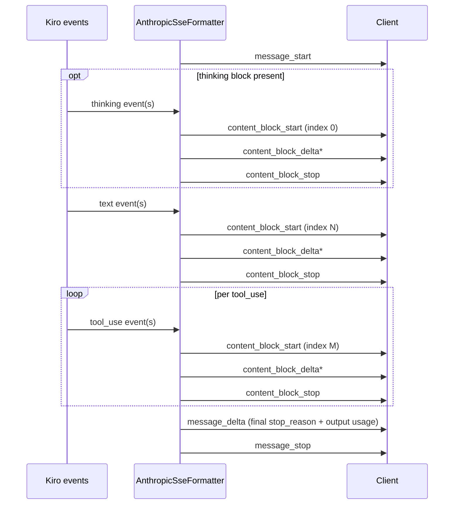

# Streaming (`upstream::parser`, `upstream::stream`, `api::*::sse`)

Kiro streams its response as a sequence of small JSON objects concatenated
back-to-back inside an AWS event-stream frame. Lanius does **not** decode
the full AWS event-stream binary framing — it works directly on the
embedded JSON fragments by pattern-matching known key prefixes, which is
enough to recover every event Kiro actually sends and is considerably
simpler than implementing the full binary format.



## `AwsEventStreamParser` (`upstream/parser.rs`)

Create one instance per response; feed it raw bytes via `feed` as they
arrive. Internally:

- **UTF-8 safety** — `decode_into_buffer` retains any trailing incomplete
  multi-byte sequence across calls rather than decoding it prematurely.
  Genuinely invalid (not just incomplete) sequences are dropped so one
  corrupt byte run can't wedge the parser forever.
- **JSON-object boundary detection** — `find_matching_brace` tracks brace
  depth while correctly skipping `{`/`}` that appear inside string
  literals (respecting `\"`-escaped quotes), operating byte-wise but only
  treating ASCII `{`, `}`, `"`, `\` specially so it never splits a
  multi-byte UTF-8 character.
- **Pattern matching** — `EVENT_PATTERNS` lists the literal JSON-fragment
  prefixes Kiro emits (`{"content":`, `{"text":`/`{"signature":` for
  reasoning, `{"name":`/`{"input":`/`{"stop":` for tool-call lifecycle,
  `{"usage":`, `{"contextUsagePercentage":`); the parser scans for
  whichever occurs earliest in the buffer to decide what to parse next.
- **Tool-call accumulation** — tool-call lifecycle fragments
  (`ToolStart`/`ToolInput`/`ToolStop`) don't map to a `ParserEvent`
  directly; they update an internal `PartialToolCall` across possibly many
  chunks, finalized and exposed only via `take_tool_calls` once a `ToolStop`
  fragment closes it.
- **Bracket-style tool calls** — an older, non-JSON convention some models
  emit inline in text content (`[Called <name> with args: {...}]`) is
  recognized separately by `parse_bracket_tool_calls`, applied to the
  fully-collected text content rather than incrementally.
- **Deduplication** — `deduplicate_tool_calls` merges repeated/partial
  entries for the same logical call: entries sharing a non-empty id are
  merged (preferring the more complete, non-`"{}"`, longer argument
  string), id-having entries are ordered before id-less ones, and finally
  any remaining `name`+`arguments`-identical entries collapse to one.
- **Truncation diagnosis** — if a tool call's accumulated JSON never
  parses cleanly, `diagnose_json_truncation` explains why (e.g. "missing 2
  closing brace(s)") and the call's `arguments` is replaced with `"{}"`,
  recorded via `ToolCall::truncation` (consumed downstream by
  [truncation.md](truncation.md)).

## `parse_kiro_stream` (`upstream/stream.rs`)

Wraps a byte stream (any `Stream<Item = Result<Bytes, reqwest::Error>>`)
with the parser above and Lanius's timeout policy:

- **First-token timeout** (`config.first_token_timeout`) — if no bytes
  arrive before this elapses, the stream ends with
  `GatewayError::FirstTokenTimeout`.
- **Streaming read timeout** (`config.streaming_read_timeout`) — applies
  after the first token, catching a stall mid-stream
  (`GatewayError::StreamReadTimeout`).

It emits `KiroEvent`s — one struct with a `KiroEventType` discriminant
(`Content`, `Thinking`, `ToolUse`, `Usage`, `ContextUsage`, `Error`) and the
relevant fields populated for that variant, constructed only via the
associated helpers (`KiroEvent::content`, `KiroEvent::thinking`, etc.) so
callers never build an inconsistent combination by hand.

`collect_stream_to_result` drains the whole stream into a `StreamResult`
(accumulated content/thinking text, deduplicated tool calls, last-seen
usage/context-usage) for the non-streaming response path; `parse_kiro_stream`
itself is used directly by the streaming response path and by `lanius-cli`'s
`probe`/`replay` subcommands.

## Re-encoding: OpenAI (`api::openai::sse`)

`encode_openai_sse` turns the `KiroEvent` stream into `chat.completion.chunk`
SSE frames: a `role` delta first, then `content`/`reasoning_content` deltas
as they arrive, `tool_calls` deltas once a call is finalized, a final chunk
carrying `finish_reason` (`"length"` if truncation was detected, `"tool_calls"`
if any tool was called, else `"stop"`), and (if the client requested
`stream_options.include_usage`) a trailing usage-only chunk, followed by the
literal `data: [DONE]` terminator.

For non-streaming requests, `collect_openai_response` drives
`collect_stream_to_result` then `response_value_from_result` assembles the
single JSON body the same way (see [request-flow.md](request-flow.md)).

## Re-encoding: Anthropic (`api::anthropic::sse`)

`AnthropicSseFormatter` is a stateful machine tracking which content block
(text/thinking/tool-use) is currently "open" so it can emit matching
`content_block_start`/`content_block_stop` pairs at the correct index as
Kiro events arrive, in the fixed sequence Anthropic clients expect:



A `ping` frame is emitted every `DEFAULT_PING_INTERVAL` (15s) while waiting
on slow upstream output, so intermediate proxies/clients don't treat the
idle SSE connection as dead. `format_sse_event` renders each frame using
Kiro's exact spaced-JSON formatting (`utils::format_json_spaced`) so
byte-for-byte comparisons against captured fixtures stay stable.

For non-streaming requests, `response_from_stream_result` performs the
equivalent assembly directly into the final JSON body.

## Tool name restoration

Both re-encoders restore original (pre-alias) tool names from the
per-request `ToolNameAliases` table before emitting any tool-call event or
text fragment that might contain an aliased name — see
[compatibility.md](compatibility.md#tool-name-aliasing) for why the
aliasing exists and how the streaming-safe restoration
(`restore_text_fragment`, which withholds enough trailing text to avoid
splitting a marker across chunks) works.

## Offline debugging: `lanius probe` / `lanius replay`

`lanius-cli`'s `probe` subcommand performs a live request and can save the
raw upstream bytes to disk (`--capture <file>`); `replay <file>` re-chunks
that capture into artificial "network reads" (`REPLAY_CHUNK_SIZE`, default
64 bytes) and feeds it through the exact same `parse_kiro_stream` used for
live traffic — entirely offline. Replaying the same fixture at multiple
chunk sizes and diffing the output is the standard way to prove the parser
is byte-boundary agnostic:

```sh
lanius probe --capture debug_logs/raw.bin
for n in 1 7 64 100000; do REPLAY_CHUNK_SIZE=$n lanius replay debug_logs/raw.bin | md5; done
```

`crates/lanius-core/tests/parser_properties.rs` automates the same
property (feeding a payload in arbitrarily-sized chunks and asserting
identical results) using `proptest`.
