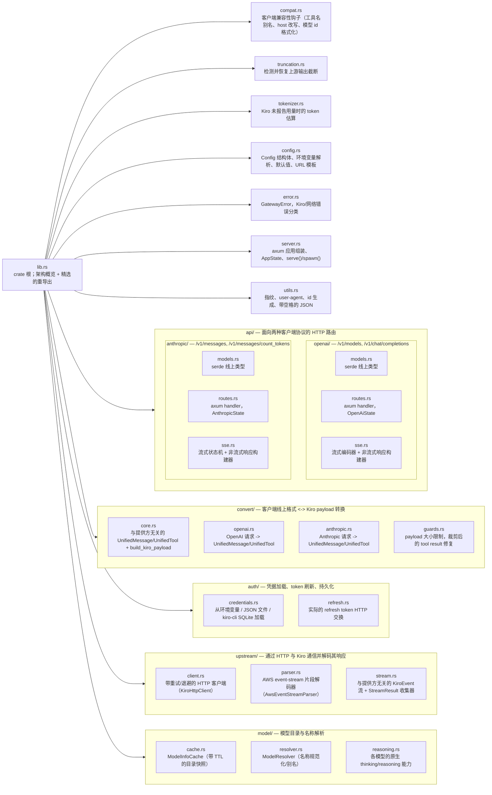
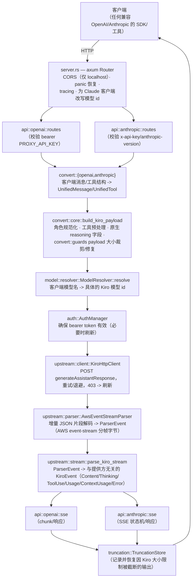

> [English](../architecture.md) | 简体中文

# 架构

## Workspace 布局

Lanius 是一个包含三个 crate 的 Cargo workspace：

| Crate | 类型 | 职责 |
|---|---|---|
| `lanius-core` | library | 网关本体：HTTP 路由、协议转换、认证、流式解析器、模型目录以及全部业务逻辑。被下面两个二进制程序共同使用。 |
| `lanius-cli` | binary (`lanius`) | 无界面的服务进程，另外提供 `probe`/`replay` 调试子命令。只是一层薄封装，自身不包含任何协议逻辑。 |
| `lanius-gui` | binary (`lanius-desktop`) | 桌面应用（Slint UI），在进程内运行网关，并提供配置、实时日志、模型列表和用量视图。 |

`lanius-core` 被刻意设计为唯一理解 OpenAI/Anthropic/Kiro 协议的地方。两个二进制程序都通过一个小而精心挑选的公共接口调用它（见 `crates/lanius-core/src/lib.rs`）；`lanius-core` 内部的其他内容都是 `pub(crate)`，只能通过各模块自己的门面（facade）访问（例如 `crate::upstream::KiroHttpClient`、`crate::model::ModelResolver`）。

## 为什么需要网关

Kiro（Amazon Q Developer / AWS CodeWhisperer）使用自己的请求/响应协议，并基于自定义的 AWS event-stream 分帧传输，而不是 OpenAI Chat Completions API 或 Anthropic Messages API。Lanius 位于 Kiro 前方，对外同时暴露这两种常见的线上格式，因此现有的、使用 OpenAI 或 Anthropic 协议的工具、SDK 和编辑器集成，无需修改任何代码即可指向 Lanius 的 `/v1/...` 端点；而认证、协议转换以及 Kiro 实际后端的各种怪癖则由 Lanius 负责处理。

## 模块图（`lanius-core`）

## 数据流

## 横切关注点

- **`config`**：每个可调参数都是一个带有文档化默认值的环境变量（见 [configuration.md](configuration.md)）；`Config::validate` 在启动时运行一次，若配置不安全或无效则拒绝提供服务。
- **`error`**：单个 `GatewayError` 枚举涵盖配置、认证、网络以及经上游分类的错误；`error::enhance_kiro_error` 将 Kiro 的原始错误 payload 转换为可操作的提示信息（例如将“超出上下文长度”与普通的 400 区分开）。
- **`compat`**：既不属于“结构转换”（`convert`）也不属于“凭据”（`auth`），但几乎适用于每个请求的行为：针对 Kiro 64 字符名称限制的工具名别名、针对仅限 control plane 操作的 host 改写，以及 Claude 客户端专用的模型 id 格式化。见 [compatibility.md](compatibility.md)。
- **`utils`**：与 Kiro 期望的线上格式逐字节匹配的逻辑（带空格的 JSON 分隔符、特定的 header 大小写/顺序、稳定的单机指纹）放在这里，因为 `convert` 和 `upstream` 都需要用到。

## 下一步阅读

- 端到端追踪一次请求：[request-flow.md](request-flow.md)
- 消息/工具结构如何转换：[conversion.md](conversion.md)
- 凭据与 token 刷新：[auth.md](auth.md)
- 解码 Kiro 的流式响应：[streaming.md](streaming.md)
