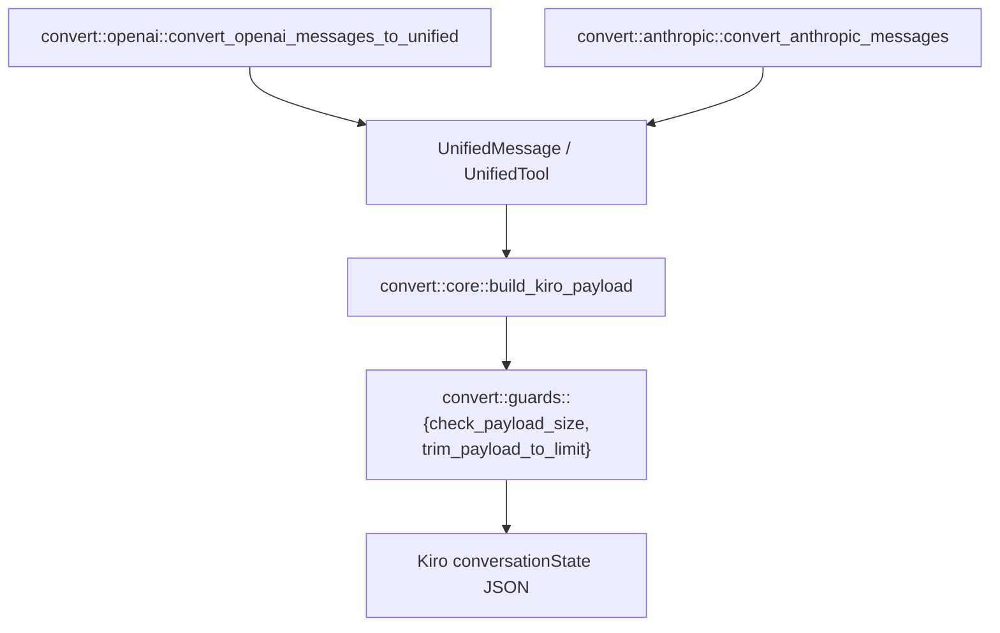

> [English](../conversion.md) | 简体中文

# 请求/响应转换（`convert`）

`convert` 模块负责在各客户端协议的线上格式与 Kiro 的 `conversationState` payload 结构之间进行转换。它被拆分为一个与提供方无关的核心，外加每种客户端协议各一个适配器，因此规范化规则（角色交替、tool result 放置、原生 reasoning 字段、payload 裁剪）只需实现和测试一次。



## 统一表示

`UnifiedMessage` 和 `UnifiedTool`（`convert/core.rs`）是两个适配器共同产出的、与提供方无关的类型：

```rust
pub struct UnifiedMessage {
    pub role: String,            // "user" | "assistant"
    pub content: Value,          // text or JSON content
    pub tool_calls: Vec<Value>,  // OpenAI-shaped, kept as raw JSON
    pub tool_results: Vec<Value>,
    pub images: Vec<UnifiedImage>,
}

pub struct UnifiedTool {
    pub name: String,
    pub description: Option<String>,
    pub input_schema: Option<Map<String, Value>>,
}
```

`tool_calls`/`tool_results` 被刻意保留为 OpenAI 结构的原始 JSON，而不是类型化的结构体，因为转换过程以及随后重新序列化为 Kiro 格式的过程都直接操作这种结构。

## 各提供方的适配器

**`convert::openai`**（`convert_openai_messages_to_unified`）：
- OpenAI 允许在列表中的任意位置出现多条 `system` 消息；这些消息会被全部提取出来，并用 `\n` 拼接成一个 system prompt 字符串，因为 Kiro 需要在最前面提供一个合并后的 prompt。
- OpenAI 将每个 tool result 表示为一条独立的 `role: "tool"` 消息。这些消息会先被缓冲而不是立即输出（`flush_tool_results`），并附加到*下一个* user 轮次的 `tool_results` 字段上：每当遇到非 tool 消息时刷新一次，并在末尾再刷新一次，以免列表以 tool result 结尾时丢失这些结果。
- `reasoning_request_from_openai` 将请求中的 `reasoning_effort` 字段映射到目标模型支持的 effort 级别上（见 [model-catalog.md](model-catalog.md)）。

**`convert::anthropic`**（`convert_anthropic_messages`）：
- 结构与 OpenAI 适配器相同，但以 Anthropic 的类型化内容块模型（`ContentBlock::{Text,Thinking,ToolUse,ToolResult,...}`）为起点，而不是 OpenAI 较为松散的 JSON 结构。
- `extract_system_prompt` 统一处理全部三种 `SystemPrompt` 形式（纯字符串、类型化块、原始回退块）。
- 原生 thinking 块及其签名会在往返过程中得到保留，从而使多轮对话能够正确地回放之前轮次的推理内容。

两个适配器都会在历史转换运行*之前*，将所有需要改写的工具名注册到一张共享的、每个请求独立的 `ToolNameAliases` 表中，这样在旧 assistant 轮次中被引用的工具和新的工具定义（名称相同）会得到相同的别名（见 [compatibility.md](compatibility.md#工具名别名)）。

## `build_kiro_payload`：与提供方无关的核心

给定统一的消息/工具，以及 system prompt、模型 id、会话 id 和 profile ARN，`build_kiro_payload` 依次执行：

1. **工具预处理**：过长的工具描述（`tool_description_max_length`）会从工具定义中移出，作为附加文档追加到 system prompt 中（`process_tools_with_long_descriptions`），然后校验剩余的工具名（`validate_tool_names`）。
2. **System prompt 组装**：调用方提供的 prompt + 迁移过来的工具文档 +（若启用 `config.truncation_recovery`）截断恢复的说明性附加内容。
3. **工具上下文预处理**（`preprocess_tool_context`）：当前轮次未声明任何工具时，或者某个 tool result 前面没有可以对应的 assistant tool call 时，将 tool call/result 展平为叙述性文本（Kiro 要求严格的 call/result 配对，而客户端并不总能保证这一点，例如在客户端进行上下文压缩之后）。
4. **角色规范化**：合并相邻的同角色轮次（`merge_adjacent_messages`），然后应用 `ensure_alternating_roles(normalize_message_roles(ensure_first_message_is_user(...)))`，使序列满足 Kiro 严格的 user/assistant 交替要求，并以 user 轮次开头。
5. **历史/当前拆分**：将规范化后的序列拆分为 `history`（除最后一条消息外的全部内容）以及 Kiro 期望作为当前轮次的 `currentMessage`。
6. **原生 reasoning 字段**：如果解析出的模型支持原生 thinking/reasoning（见 [model-catalog.md](model-catalog.md)），则通过 `ReasoningCapability::request_fields` 将请求的 reasoning 设置渲染为 Kiro 的 `additionalModelRequestFields` 结构，并放在请求的顶层发送（Kiro 会忽略放在其他位置的该字段）。
7. **大小限制**（`convert::guards`）：按照 Kiro 的计数方式测量组装后 payload 的大小（紧凑的 ASCII 转义 JSON，因此多字节字符按其 `\uXXXX` 转义后的长度计算，而不是原始 UTF-8 字节数，见 `check_payload_size`）。如果超过 `kiro_max_payload_bytes` 且启用了 `auto_trim_payload`，`trim_payload_to_limit` 会反复从历史中删除*最旧的一对 user/assistant*（从不删除单条记录，以保持交替结构完整），直到大小符合要求；然后修复因裁剪而悬空的 `toolResults` 条目（`repair_orphaned_tool_results`），并删除成对裁剪未能干净处理掉的、开头的非 user 条目。

结果是一个 `KiroPayloadResult { payload, tool_documentation }`：可以直接发送的请求体，以及被移入 system prompt 的工具文档文本（单独返回，以便调用方可以记录日志或检查它等）。

## 图片

无论来源结构如何，内联图片都会被规范化为 `UnifiedImage { media_type, data }`：OpenAI 带 `data:` URL 的 `image_url`（`extract_images_from_content` 通过 `parse_data_url` 解析 data URL），或 Anthropic 带显式 base64 `source` 的 `image` 块。格式错误或数据为空的块会被静默跳过而不是报错，因为单张有问题的图片不应导致一个其他方面都有效的请求失败。

## 测试本模块

`convert/openai.rs`、`convert/anthropic.rs`、`convert/core.rs` 和 `convert/guards.rs` 各自带有 `#[cfg(test)]` 单元测试，公共函数上也有 doctest。`tests/tool_followup_payload.rs` 是一个集成测试，专门覆盖完整转换过程中工具定义/tool result 的别名往返。
