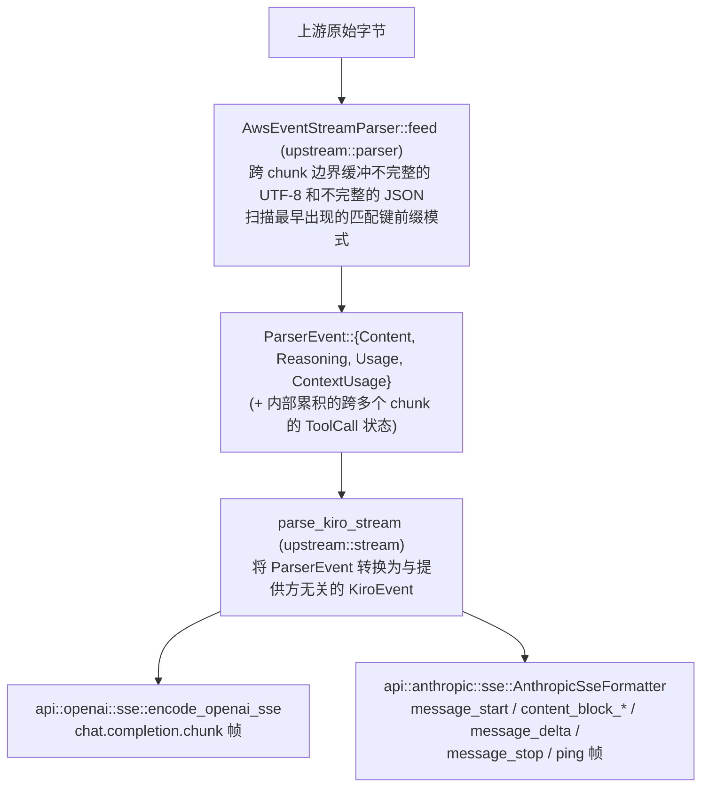
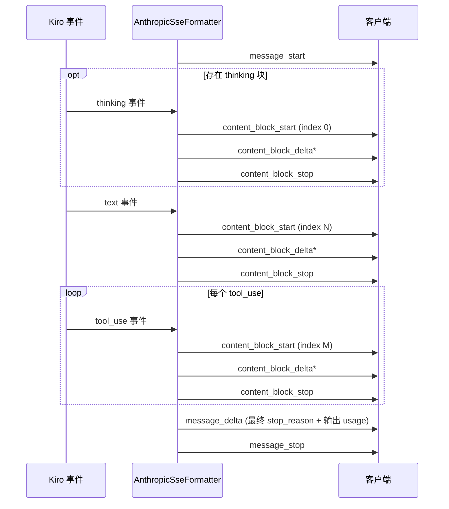

> [English](../streaming.md) | 简体中文

# 流式传输（`upstream::parser`、`upstream::stream`、`api::*::sse`）

Kiro 以一系列小型 JSON 对象的形式流式返回响应，这些对象首尾相接地拼接在 AWS event-stream 帧中。Lanius **并不**解码完整的 AWS event-stream 二进制分帧，而是通过匹配已知的键前缀，直接处理其中嵌入的 JSON 片段。这足以还原 Kiro 实际发送的每一个事件，而且比实现完整的二进制格式简单得多。



## `AwsEventStreamParser`（`upstream/parser.rs`）

每个响应创建一个实例；原始字节到达时通过 `feed` 喂给它。其内部机制如下：

- **UTF-8 安全**：`decode_into_buffer` 会在多次调用之间保留末尾不完整的多字节序列，而不是过早解码。真正无效（而不仅仅是不完整）的序列会被丢弃，这样一段损坏的字节就不会让解析器永远卡住。
- **JSON 对象边界检测**：`find_matching_brace` 跟踪花括号深度，同时正确跳过出现在字符串字面量内部的 `{`/`}`（并识别 `\"` 转义的引号）。它按字节操作，但只特殊处理 ASCII 的 `{`、`}`、`"`、`\`，因此绝不会切断多字节 UTF-8 字符。
- **模式匹配**：`EVENT_PATTERNS` 列出了 Kiro 发出的字面 JSON 片段前缀（`{"content":`；reasoning 对应 `{"text":`/`{"signature":`；tool call 生命周期对应 `{"name":`/`{"input":`/`{"stop":`；以及 `{"usage":`、`{"contextUsagePercentage":`）。解析器会扫描缓冲区中最早出现的那个，以决定接下来解析什么。
- **Tool call 累积**：tool call 生命周期片段（`ToolStart`/`ToolInput`/`ToolStop`）不会直接映射为 `ParserEvent`；它们会跨越可能很多个 chunk 更新内部的 `PartialToolCall`，只有在 `ToolStop` 片段将其关闭后，才会完成并通过 `take_tool_calls` 暴露出来。
- **方括号形式的 tool call**：一些模型会在文本内容中内联输出一种较旧的非 JSON 约定（`[Called <name> with args: {...}]`），由 `parse_bracket_tool_calls` 单独识别。它作用于完整收集后的文本内容，而不是增量处理。
- **去重**：`deduplicate_tool_calls` 会合并同一逻辑调用的重复/不完整条目：共享非空 id 的条目会被合并（优先选择更完整、非 `"{}"`、更长的参数字符串），有 id 的条目排在无 id 的条目之前，最后剩余的 `name`+`arguments` 完全相同的条目会折叠为一条。
- **截断诊断**：如果某个 tool call 累积的 JSON 始终无法被干净地解析，`diagnose_json_truncation` 会解释原因（例如 "missing 2 closing brace(s)"），并将该调用的 `arguments` 替换为 `"{}"`，诊断记录在 `ToolCall::truncation` 中（由下游的 [truncation.md](truncation.md) 使用）。

## `parse_kiro_stream`（`upstream/stream.rs`）

用上述解析器和 Lanius 的超时策略包装一个字节流（任意 `Stream<Item = Result<Bytes, reqwest::Error>>`）：

- **首 token 超时**（`config.first_token_timeout`）：如果在此时间内没有任何字节到达，流会以 `GatewayError::FirstTokenTimeout` 结束。
- **流式读取超时**（`config.streaming_read_timeout`）：在首个 token 之后生效，用于捕获流中途的停滞（`GatewayError::StreamReadTimeout`）。

它输出 `KiroEvent`：一个带有 `KiroEventType` 判别字段（`Content`、`Thinking`、`ToolUse`、`Usage`、`ContextUsage`、`Error`）的结构体，并填充该变体对应的相关字段。它只能通过关联的辅助函数（`KiroEvent::content`、`KiroEvent::thinking` 等）构造，因此调用方永远不会手工拼出不一致的组合。

`collect_stream_to_result` 会把整个流消费为一个 `StreamResult`（累积的 content/thinking 文本、去重后的 tool call、最后一次看到的 usage/context-usage），供非流式响应路径使用；`parse_kiro_stream` 本身则由流式响应路径以及 `lanius-cli` 的 `probe`/`replay` 子命令直接使用。

## 重新编码：OpenAI（`api::openai::sse`）

`encode_openai_sse` 把 `KiroEvent` 流转换为 `chat.completion.chunk` SSE 帧：首先是一个 `role` delta，然后随事件到达输出 `content`/`reasoning_content` delta，在调用完成后输出 `tool_calls` delta，接着是一个携带 `finish_reason` 的最终 chunk（检测到截断时为 `"length"`，有任何工具被调用时为 `"tool_calls"`，否则为 `"stop"`），以及（如果客户端请求了 `stream_options.include_usage`）一个末尾只包含 usage 的 chunk，最后是字面的 `data: [DONE]` 终止符。

对于非流式请求，`collect_openai_response` 先驱动 `collect_stream_to_result`，再由 `response_value_from_result` 以同样的方式组装出单个 JSON 响应体（参见 [request-flow.md](request-flow.md)）。

## 重新编码：Anthropic（`api::anthropic::sse`）

`AnthropicSseFormatter` 是一个有状态的状态机，跟踪当前"打开"的是哪个内容块（text/thinking/tool-use），从而在 Kiro 事件到达时，在正确的 index 上输出成对的 `content_block_start`/`content_block_stop`，并遵循 Anthropic 客户端期望的固定顺序：



在等待缓慢的上游输出时，每隔 `DEFAULT_PING_INTERVAL`（15 秒）会发出一个 `ping` 帧，以免中间代理/客户端把空闲的 SSE 连接当作已断开。`format_sse_event` 使用与 Kiro 完全一致的带空格 JSON 格式（`utils::format_json_spaced`）渲染每一帧，从而使与捕获的 fixture 进行逐字节比较的结果保持稳定。

对于非流式请求，`response_from_stream_result` 会直接执行等价的组装，生成最终的 JSON 响应体。

## 工具名还原

两个重新编码器在输出任何 tool call 事件或可能包含别名的文本片段之前，都会根据每个请求的 `ToolNameAliases` 表还原原始（别名化之前的）工具名。关于为什么需要别名，以及流式安全的还原（`restore_text_fragment`，它会保留足够多的尾部文本以避免标记被切分到不同 chunk 中）如何工作，参见 [compatibility.md](compatibility.md#工具名别名)。

## 离线调试：`lanius probe` / `lanius replay`

`lanius-cli` 的 `probe` 子命令会发起一次真实请求，并可将上游原始字节保存到磁盘（`--capture <file>`）；`replay <file>` 会把该捕获重新切分为人为的"网络读取"（`REPLAY_CHUNK_SIZE`，默认 64 字节），并送入与线上流量完全相同的 `parse_kiro_stream`，整个过程完全离线。用多种 chunk 大小重放同一个 fixture 并对比输出，是证明解析器与字节边界无关的标准做法：

```sh
lanius probe --capture debug_logs/raw.bin
for n in 1 7 64 100000; do REPLAY_CHUNK_SIZE=$n lanius replay debug_logs/raw.bin | md5; done
```

`crates/lanius-core/tests/parser_properties.rs` 使用 `proptest` 自动化验证同一性质（以任意大小的 chunk 喂入 payload，并断言结果完全一致）。
